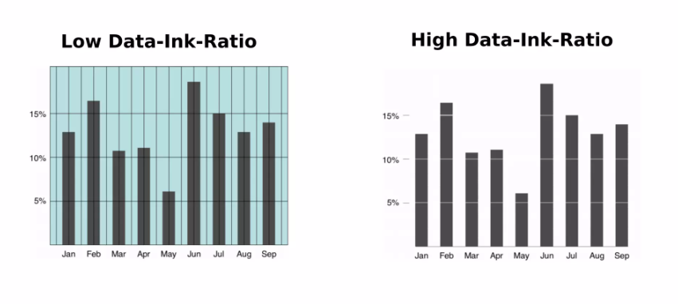

# Design Technique

1. `Set Priority` : use size & color to make your information stand out (Making a difference).
2. `Round numbers` : Avoid typing numbers with large values ​​or lots of digits. Use short abbreviations to make it easy to read and less cluttered.
3. `Data Ink` : Try to cut out unnecessary parts (Non-Data Ink) from the dashboard to leave only necessary information (Data Ink) to present.
   
4. `Arrange data group` : Try to keep related data in the same display area, For easy and continuous viewing of the summary data.
5. `Way of presentation` : Choosing a graph to present a set of data that are similar.
6. `Reading Pattern` : People read from left to right, top to bottom, so the information you want to see first should be placed in the top left and largest position.
   

Information sourced from a [Tech Ninja](https://www.facebook.com/share/p/frLmTinXTtezYzpW/).
