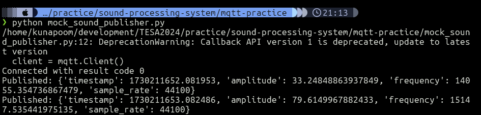
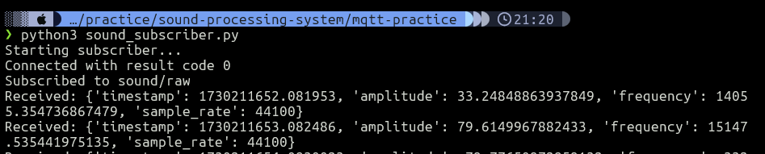

## docker-compose.yml for Mosquitto MQTT broker
```yml
version: '3.8'
services:
  mqtt-broker:
    image: eclipse-mosquitto:latest
    ports:
      - "1883:1883"  # MQTT default port
      - "9001:9001"  # WebSocket port
    volumes:
      - ./mosquitto/config:/mosquitto/config
      - ./mosquitto/data:/mosquitto/data
      - ./mosquitto/log:/mosquitto/log
```

## Create Mosquitto configuration
```bash
mkdir -p mosquitto/config
```

## Create mosquitto/config/mosquitto.conf
```
listener 1883
allow_anonymous true
persistence true
persistence_location /mosquitto/data/
log_dest file /mosquitto/log/mosquitto.log
```

## Start the MQTT broker
```bash
docker-compose up -d
```

##  Install required packages
```bash
python -m venv venv
source venv/bin/activate

pip install paho-mqtt python-dotenv
```

## Create a publisher script (mock_sound_publisher.py)
```python
import paho.mqtt.client as mqtt
import json
import time
import random

# MQTT Settings
MQTT_BROKER = "localhost"
MQTT_PORT = 1883
MQTT_TOPIC = "sound/raw"

# Connect to MQTT broker
client = mqtt.Client()

def on_connect(client, userdata, flags, rc):
    print(f"Connected with result code {rc}")

client.on_connect = on_connect

try:
    client.connect(MQTT_BROKER, MQTT_PORT, 60)
except Exception as e:
    print(f"Failed to connect to MQTT broker: {e}")
    exit(1)

# Start the loop
client.loop_start()

try:
    while True:
        # Generate mock sound data
        mock_data = {
            "timestamp": time.time(),
            "amplitude": random.uniform(0, 100),
            "frequency": random.uniform(20, 20000),
            "sample_rate": 44100
        }
        
        # Publish data
        client.publish(MQTT_TOPIC, json.dumps(mock_data))
        print(f"Published: {mock_data}")
        time.sleep(1)  # Publish every second

except KeyboardInterrupt:
    print("Stopping publisher...")
    client.loop_stop()
    client.disconnect()
```

## Create a subscriber script (sound_subscriber.py)
```python
import paho.mqtt.client as mqtt
import json

# MQTT Settings
MQTT_BROKER = "localhost"
MQTT_PORT = 1883
MQTT_TOPIC = "sound/raw"

def on_connect(client, userdata, flags, rc):
    print(f"Connected with result code {rc}")
    client.subscribe(MQTT_TOPIC)
    print(f"Subscribed to {MQTT_TOPIC}")

def on_message(client, userdata, msg):
    try:
        data = json.loads(msg.payload.decode())
        print(f"Received: {data}")
    except json.JSONDecodeError as e:
        print(f"Error decoding message: {e}")

# Set up MQTT client
client = mqtt.Client()
client.on_connect = on_connect
client.on_message = on_message

# Connect to broker
try:
    client.connect(MQTT_BROKER, MQTT_PORT, 60)
except Exception as e:
    print(f"Failed to connect to MQTT broker: {e}")
    exit(1)

# Start the loop
print("Starting subscriber...")
client.loop_forever()
```
!!!success

    When you run the publisher script, it will start **publishing messages to the topic every second**. The subscriber script will receive these messages and print them to the console.


