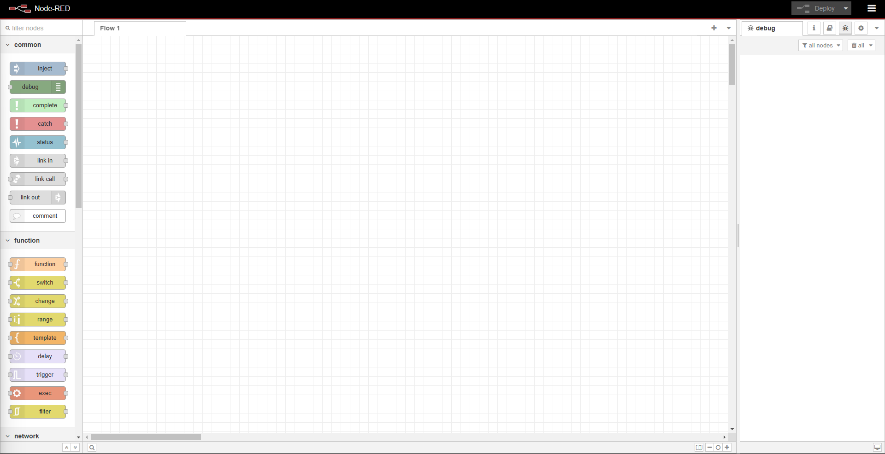

## Update docker-compose.yml to include Node-RED
```yml
# docker-compose.yml
version: '3.8'
services:
  mqtt-broker:
    image: eclipse-mosquitto:latest
    ports:
      - "1883:1883"
      - "9001:9001"
    volumes:
      - ./mosquitto/config:/mosquitto/config
      - ./mosquitto/data:/mosquitto/data
      - ./mosquitto/log:/mosquitto/log
    networks:
      - sound-network

  nodered:
    image: nodered/node-red:latest
    ports:
      - "1880:1880"
    volumes:
      - ./nodered-data:/data
    depends_on:
      - mqtt-broker
    networks:
      - sound-network

networks:
  sound-network:
    driver: bridge
```

## Create a directory for Node-RED data:
```
mkdir nodered-data
```

## Start the services:
```
docker-compose up -d
```

## Access Node-RED:


Let's create our first Node-RED flow for sound processing. We'll need to install some additional nodes first. In Node-RED, go to the menu (top right) -> Manage palette -> Install and add these nodes:

```
node-red-contrib-mqtt-broker 
node-red-dashboard (for visualization)
```

!!! failure

    Can't connect nodered to mqtt broker in docker
    (try to look around network configuration)
