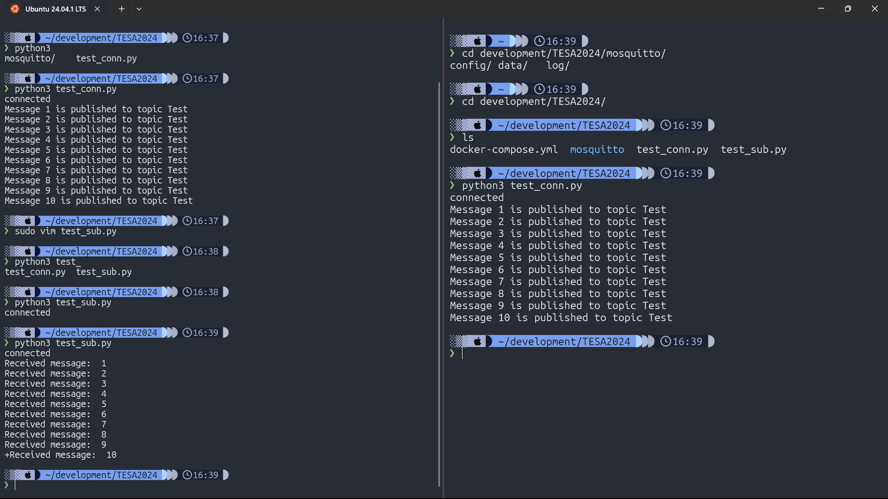

I followed the steps outlined in the reference website to complete this lab.
[Ultimate Guide to Mosquitto Docker Configuration](https://cedalo.com/blog/mosquitto-docker-configuration-ultimate-guide/)

## Project Structure

```bash
    .
    ├── docker-compose.yml
    ├── mosquitto
    │   ├── config
    │   │   └── mosquitto.conf
    │   ├── data
    │   │   └── mosquitto.db
    │   └── log
    │       └── mosquitto.log
    ├── test_conn.py
    └── test_sub.py
```

## MQTT Broker

Create a container from image:

```bash
docker run -it -d --name mos1 -p 1883:1883 -v /etc/mosquitto/mosquitto.conf:/mosquitto/config/mosquitto.conf -v /etc/mosquitto/passwd_file:/mosquitto/config/passwd_file eclipse-mosquitto:2
```

Save the config file mosquitto.conf to /mosquitto/config

```bash
❯ cat ./mosquitto/config/mosquitto.conf
# Place your local configuration in /etc/mosquitto/conf.d/
#
# A full description of the configuration file is at
# /usr/share/doc/mosquitto/examples/mosquitto.conf.example

#pid_file /run/mosquitto/mosquitto.pid

persistence true
persistence_location /mosquitto/data/
log_dest file /mosquitto/log/mosquitto.log
log_dest stdout

# include_dir /etc/mosquitto/conf.d

allow_anonymous true
listener 1883 0.0.0.0
```

### MQTT Broker Docker-Compose setup

```yml
version: "3.8"

services:
  mosquitto:
    image: eclipse-mosquitto:2
    ports:
      - 1884:1883
      - 8883:8883
      - 9001:9001
    volumes:
      - ./mosquitto/config:/mosquitto/config
      - ./mosquitto/data:/mosquitto/data
      - ./mosquitto/log:/mosquitto/log
    networks:
      - mosquitto
networks:
  mosquitto:
    name: mosquitto
    driver: bridge
```

### Python Code test connection and sub topic

```python
import paho.mqtt.client as mqtt
import time

broker_hostname = "localhost"
port = 1883

def on_connect(client, userdata, flags, return_code):
    if return_code == 0:
        print("connected")
    else:
        print("could not connect, return code:", return_code)

client = mqtt.Client("Client1")
# client.username_pw_set(username="user_name", password="password") # uncomment if you use password auth
client.on_connect = on_connect

client.connect(broker_hostname, port)
client.loop_start()

topic = "Test"
msg_count = 0

try:
    while msg_count < 10:
        time.sleep(1)
        msg_count += 1
        result = client.publish(topic, msg_count)
        status = result[0]
        if status == 0:
            print("Message "+ str(msg_count) + " is published to topic " + topic)
        else:
            print("Failed to send message to topic " + topic)
            if not client.is_connected():
                print("Client not connected, exiting...")
                break
finally:
    client.disconnect()
    client.loop_stop()
```

```python
import paho.mqtt.client as mqtt
import time

def on_connect(client, userdata, flags, return_code):
    if return_code == 0:
        print("connected")
        client.subscribe("Test")
    else:
        print("could not connect, return code:", return_code)
        client.failed_connect = True


def on_message(client, userdata, message):
    print("Received message: ", str(message.payload.decode("utf-8")))


broker_hostname ="localhost"
port = 1883

client = mqtt.Client("Client2")
# client.username_pw_set(username="user_name", password="password") # uncomment if you use password auth
client.on_connect = on_connect
client.on_message = on_message
client.failed_connect = False

client.connect(broker_hostname, port)
client.loop_start()

# this try-finally block ensures that whenever we terminate the program earlier by hitting ctrl+c, it still gracefully exits
try:
    i = 0
    while i < 15 and client.failed_connect == False:
        time.sleep(1)
        i = i + 1
    if client.failed_connect == True:
        print('Connection failed, exiting...')

finally:
    client.disconnect()
    client.loop_stop()
```

!!! success

    MQTT publish/subscribe communication is working correctly between the two programs through an MQTT broker.


